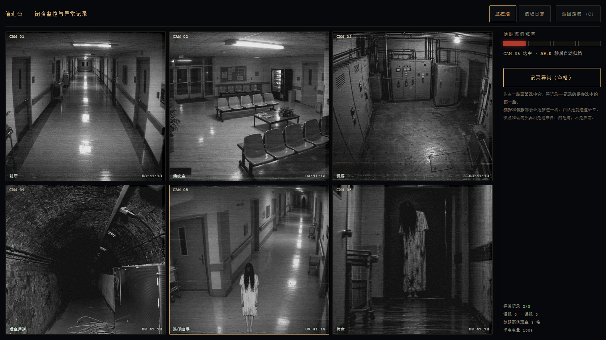
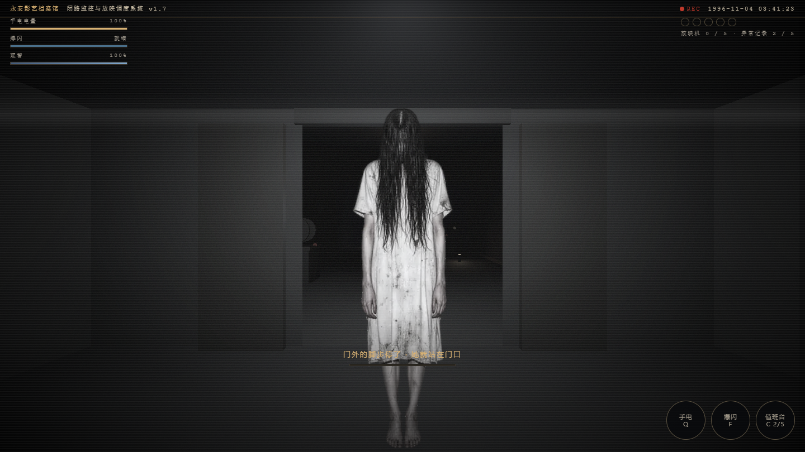

# 午夜放映员 · Midnight Projectionist

一个**模拟恐怖（analog horror）网站**形态的 3D 走廊潜行游戏。
单文件、离线、不联网。整个界面是一盘 1996 年的监控录像带：VHS 噪点、CRT 扫描线、走动的磁带时间码。

**双击 `index.html` 就能玩。**（`three.min.js` 必须和它在同一个文件夹里。）

---

## 三层，一份电量，一份理智

**第一层 · 走廊。** 穿过走廊，启动五台放映机。她在走廊里，杀不死，只能被挡住。
被她抓到的代价**不是死**——是理智掉一大截，然后被拖回值班室。

**第二层 · 值班室。** 走廊尽头有一间你**能走进去**的房间。这里她进不来，理智会慢慢回来。
但「待着」不推进任何进度，而监控上的异常还在一条条攒。
**安不安全，取决于你敢不敢一直安全下去。**

**第三层 · 值班台。** 走到台前坐下，六路画面就是六个房间。把「真异常」记进值班日志：
窗口越来越短、人形越来越淡、磁带自己的毛病会混进来骗你。漏一条或报错一条，
都来一次**突脸**（占满整个屏幕的那种），理智再掉一截，她往前推一格。

**只有两件事会真的结束这一局：理智见底，或者四格满。**
而这两条线最后都收在同一件事上——**她走进值班室，一步一步走到你面前，贴到你脸上。**

**通关：五台放映机全亮 + 值班日志五条异常记录，然后走到走廊尽头。**

---

## 走廊

走廊停电了。五台放映机要一台台启动，尽头的大门才会开。

**走廊里还有她。她杀不死，只能被挡住。**

### 三条规则

1. **黑暗里她走得动，光里她动不了。**
2. **手电开着一秒掉 3.2% 电量，关掉一秒回 2.2%。** 你关掉的时候，她就在走。
3. **光要照得够近才按得住她——9 米以内。** 远了她只是被照亮，照样朝你走。

### 三种突破手段

| | 手段 | 代价 | 什么时候用 |
|---|---|---|---|
| ① | **按光**：光锥对着她，且她在 9 米内，她就定住 | 每秒 3.2% 电 | 常规手段。转身、照住、再走 |
| ② | **爆闪**（F）：推开约 6 米、定身 3.4 秒。**正面全额，绕到你背后也推得开（约六成）** | 25% 电 + 11 秒冷却 | 被围住时唯一的出路 |
| ③ | **放映机**：启动过的会一直亮着，半径 6.2 米内她动不了 | 启动时要站着不动 1.6 秒 | 存档点。也是走廊里唯一能喘气的地方 |

### 难度

走廊里**同时最多 5 只**，起速 1.74 米/秒（你 3.05），每开一台放映机她**再快 0.28**。
上一版是 3 只、1.42、+0.16——那个数值可以靠走位磨过去。现在走廊中段开始就必须用光钉、用爆闪甩，
硬跑一定被追上。但**被抓不等于输**（见下），所以这个难度是可以反复承受的。

**核心抉择**：光能看见她、能钉住她，但光会耗尽。你永远在「看得见」和「还有电」之间选。

### 操作

| 键盘 | 触摸 |
|---|---|
| `W A S D` 移动 | 左下虚拟摇杆 |
| 拖动鼠标转视角 | 右侧拖动转视角 |
| `Q` 手电开关 | 「手电」按钮 |
| `F` 爆闪击退 | 「爆闪」按钮 |
| 靠近放映机**按住 `E`** 1.6 秒 | 同上（走过去按住） |
| 走廊走到最北端 = 进值班室 | 同左 |
| 站在值班台前**按住 `E`** 0.9 秒坐下 | 同上（走过去按住） |
| 值班台里 `1`–`6` 选画面 | 点画面选 |
| 值班台里 `空格` 上报 | 「记录异常」按钮 |
| 值班台里 `C` / `ESC` 起身离开 | 「返回走廊」按钮 |

### 被抓之后

**她抓到你的那一刻是一次全屏突脸，然后你被拖回值班室，理智掉 32。**

放映机进度**保留**——已经亮着的不会灭，你不用从头再来。但她会**更快**，也会**变多**。
理智在值班室里会以每秒 1.8 的速度慢慢回来，所以被抓不是终局，
而是**一笔可以从容还、但还不完的债**。真正会死的是**理智见底**：连被抓四次左右，或者监控上连续犯错。

被抓时她已经贴到 1 米内了，所以你不会有"莫名其妙就死了"的感觉——
黑暗里你唯一的信息是**声音**：方位声像告诉你她在左还是右，心跳告诉你她有多近。

---

## 值班室

走廊最北端接出来的一间房。**它是全图唯一一个她进不来的地方**
（除了最后那一次——四格满的时候她会撞开门走进来）。

房间里有灯、有桌子、一排机箱、六块小屏，和一把椅子。**你可以走。**
灯是这栋楼里唯一稳定的光源，但它不稳。

走进去的理由：理智会回。走出来的理由：**待在这儿什么都不会发生。**
放映机在走廊里等着，监控上的异常不会等你。

## 值班台（走到椅子前，按住 `E` 坐下）

四路变六路了，因为**每个房间都要有人盯**。**她进不来**——但你坐在那儿的时候，
走廊里是静止的，而且值班台**自己耗电**。它不是避风港，是一个要付利息的暂停键。

### 你要做的事

**先点一路画面选中它，再按空格记录。记录的是你选中的那一路。**

画面里会出现两种东西，**只有一种是真异常**：

| | 现象 | 你该做什么 |
|---|---|---|
| **真异常** | 某个房间**出现人形** / 某一路**断电黑屏** | 选中**出问题的那一路**，记录（记一条，还回电 12%，理智 +8） |
| **磁带毛病** | 噪点加重、画面纵向失真、画面抖动 | **不要报**（报了算误报） |

**误报一次、漏报一次，都推进一格，并且立刻来一次突脸、掉一截理智。四格 = 她撞开值班室的门走进来。**

三种会推进一格的情况：

1. 选中了**没有异常**的那一路就按记录
2. 把**磁带干扰**当成异常报上去
3. 异常出现了，**你没在窗口内记录**（或者直接关掉值班台走人）

> 为什么"选错路"要罚：不罚的话，你只要看见任何一路有异动就按空格，
> 四路画面就只是背景图，"判断"这个唯一的博弈就不存在了。
> 报对给 12% 电、报错只罚半格的话，"见异常就报"会变成最优解——所以两者的代价必须对等。

### 为什么这个循环难

- **六个房间要同时盯**，异常落在哪一路是随机的。
- **窗口会越来越短**：第一条异常给你 6.6 秒，到后面只剩 3.9 秒。
- **人形会越来越淡**：第一条不透明度 0.96，到后面只剩 0.44——贴着噪点看才看得见。
- **开局不会给你陷阱**。前几条只有真异常，先教会你"什么算异常"，之后才把磁带干扰混进来。
- **磁带的毛病和异常长得很像**。这是整套玩法的核心：你要判断的是
  「**是这台机器坏了，还是这栋楼里有东西**」。

### 隐藏内容

值班日志里第 7 页是隐藏档案，能调阅出一段真实影像。自己找。

---

## 设置

- **低惊吓模式**：关掉红屏闪烁与刺耳音效，适合当众演示。
- **音效**：默认开。第一次点「关灯，进去」之前不会发出任何声音。
- **视角灵敏度**：0.4 ~ 2.2。

设置和进度都存在本机浏览器里（`localStorage`），不联网、不上传。

---

## 三个版本

**v1 · 几何体拼的女鬼 + 一条纯走廊。** 玩法只有"开灯、转身、走"。

**v2 · 换成真实照片 + VHS 滤镜**，加了一层值班台（四路监控 / 异常识别）。
原因是 v1 **赢得太轻松**：走廊那层只有一个正确解（转身、照住、走），
学会了就只剩重复执行。第二层加的不是"更多敌人"，而是**一个只有玩家会犯错的环节**。

**v3 · 值班室 + 理智 + 突脸（当前）。** 三个问题一起修：

1. 那张特写只在被抓时半透明闪 0.76 秒——**有图没用，得做成突脸**。
   现在是全屏、屏幕自己在抖、RGB 分离、一声不该存在的响；四张变体轮换，
   再叠随机镜像 / 微旋转 / 缩放，保证每次"贴脸的方式"都不一样。
2. 「被抓」原来只有一种结果——死。玩家要么怕得不敢动，要么死了就退出。
   现在走廊被抓 = 扣理智 + 被拖回值班室，放映机进度保留，**可以反复承受**。
   压力从"千万别死"变成"还能撑几次"。
3. 值班室原来只是贴在屏幕上的一层界面。现在它是一间**真房间**：能走、能坐、
   能被撞开门。而最后那一下——**她会走进来，一步一步走到你面前**。

| v2：四路监控 | v3：六个房间 |
|:---:|:---:|
|  |  |
| **v2：被抓 = 结束** | **v3：她撞开门走进值班室** |
|  |  |

完整推导写在 [`设计说明.md`](设计说明.md)。

---

## 技术说明

- 单个 HTML 文件 + 本地 `three.min.js`（Three.js r160），无构建、无 CDN。
- **15 张恐怖素材全部 base64 内联在 HTML 里**（`<script id="artData" type="application/json">`）。
  这不是为了好看——`file://` 下浏览器会拦掉 `fetch` / `XHR`，只有内联的 `data:` URI 能显示。
  代价是文件从 358 KB 涨到 1.72 MB，换来"双击就能玩、不联网、不 404"。
  原始图先压到 880×587 再有损编码（WebP 带 alpha、其余 JPEG q66~80），15 张共 1.00 MB。
- **4 张突脸是同一张特写做的变体**（原图 / 镜像压暗 / 极近裁切 / 惨白高饱和），
  由 `prep_fear.py` 生成。同一张脸连看三次就不吓人了——变体比"更多素材"便宜得多。
  这 4 张在页面加载时**预热解码**：一次突脸只有 400~900 毫秒，
  第一次才现解码的话屏幕上会是一块还没出图的黑底。
- **突脸的收尾定时器必须先掐掉再挂新的。** 这是一个修过的真 bug：
  `scare()` 每次都新挂一个 940ms 的定时器去删 `on` 类，却不取消上一个。
  而她抓到你走的是强制突脸（绕过连击保护），于是上一次的定时器正好在这次播到一半时
  把屏幕清黑——**先亮出一张脸，然后毫无预兆地全黑**。`test_san.cjs` 里有专门的一条断言钉住它。
- **值班室的门是虚掩的，中间留 0.5m 的缝。** 缝只为一个目的：她走到门外时，
  你回头能从缝里看见走廊里那条黑影。原来的门关得死死的、门洞里还堵着一块纯黑平面，
  所以"门缝里的影子"只是注释里的一句话，屏幕上根本看不见——现在它看得见，
  门外也因此多了一盏很暗的灯，专门给门缝垫一点底光。
- 光源强度不是"看着调的"：`PointLight` 在 Three.js r155 之后是物理单位（candela，衰减 1/d^decay），
  按旧习惯给 7.0 的话整间值班室接近纯黑。`tools/analyze_light.py` 量了截图的
  均值 / 中位 / 可读像素占比，最后顶灯给到 30 才把房间从"看不见"变成"能走但明显昏暗"
  （调之前中位亮度 13/255，调之后 31/255；走廊是 14/255，值班室仍只比它亮一档）。
- **女鬼是一张 Sprite 贴图**（billboard，永远正面朝你），不是几何体拼的。
  锚点在脚底（`center.set(0.5, 0)`），身高 2.3 米、按原图比例缩放，不会被拉变形。
  材质自发光，亮度在 `updateHunt` 里按距离手动压暗——远处退成灰影，近处才亮起来。
- **所有音效都是 WebAudio 现场合成的**，不含任何音频文件：
  - 存在感用两个相差 0.8Hz 的正弦叠加产生拍频（听久了会不舒服），左右声道跟着她的方位走。
  - 脚步、手电开关、放映机转动、爆闪、被抓，全部由振荡器 + 滤波器 + 噪声实时生成。
- 灰尘用加法混合 + 逐点着色，只在手电光锥里亮起来——黑暗里它完全不存在。
- 光源：手电是 `SpotLight`，钉住判定用的是独立的锥角与距离（比视觉光锥略宽，手感更宽容）。
- **VHS/CRT 层走一套统一的 `setInterval` 时钟**（磁带时间码、噪点、扫描线、画面抖动全靠它）。
  故意不用 `requestAnimationFrame`——测试的"渲染循环泄漏"判据看的就是 `__raf` 计数，
  监控层如果挂 rAF 上会把那条判据污染成假阳性。
- **值班台打开时整个走廊暂停**（`running = false`），`visibilitychange` 里也加了 `!cctv.open` 守卫，
  免得切回页签时把暂停状态误恢复掉。

## 想自己调数值

所有手感参数集中在文件开头的 `CFG` 里：

```js
const CFG = {
  eye:1.62, walk:3.05, look:0.0038,      // 身高 / 步速 / 视角灵敏度
  spotRange:20,                          // 手电照亮的视觉距离
  spotPower:16, spotDecay:0.90,          // 手电照度与衰减
  freezeR:9,                             // 光真正能钉住她的距离（关键平衡）
  lightCos:0.86,                         // 光锥判定（越小越宽容）
  drain:3.2, regen:2.2, torchMin:10,     // 耗电 / 回电 / 最低开灯电量
  safeR:6.2, catchR:0.98,                // 放映机安全圈 / 被抓距离
  flashCost:25, flashCd:11, flashR:6.5, flashPush:6.2, flashStun:3.4,
  holdNeed:1.6, holdRange:1.95,          // 按住 E 的时长 / 触发距离
  ghostSpeed:1.74, ghostGrow:0.28, maxGhosts:5,
  sanMax:100, sanHall:32, sanMiss:20, sanFalse:14, sanReport:8, sanSafeRegen:1.8
};
```

**最影响难度的是三个数**：`freezeR`（光能钉住她的距离）、`drain`（耗电速度）、`ghostSpeed`（她的速度）。
玩家步速 3.05 明显快过她，所以**你永远跑得掉**——压力来自那些必须站住不动的时刻，不是来自跑不过。

**理智相关的五个数**：`sanHall`（走廊被抓）、`sanMiss`（漏报）、`sanFalse`（误报）、
`sanReport`（记对回一点）、`sanSafeRegen`（值班室里每秒回多少）。
想让游戏更温和就把前三个调小；想让"被抓"变成纯粹的惩罚就把 `sanSafeRegen` 调到 0。
`needReports` 那个 5 是 `NEED_REPORTS`，和放映机数量 `STATIONS.length` 是两回事，
别只改一个——大门要求两个条件同时满足。

---

## 调试钩子

文件末尾挂了 `window.__MP`，把内部状态暴露出来，方便自动化验证。它不影响玩法：

```js
__MP.state      // 玩家位置、电量、手电、冷却、进度、生死
__MP.ghosts     // 每个她的位置、是否被定住、速度
__MP.stations   // 五台放映机的开关状态
__MP.door       // 大门开关与门叶位置
__MP.sim(秒)    // 不依赖渲染循环，直接推进世界（用于确定性测试）
__MP.pause() / __MP.resume()

// 值班台 / 异常识别
__MP.cctv            // 上报数、误报数、漏报数、格数、当前异常、难度
__MP.cams()          // 六个房间的名称、位置、背景素材
__MP.openCctv() / __MP.closeCctv()
__MP.cctvForce(type) // 立刻生成一个指定异常（'her' / 'black'）
__MP.cctvSpawn()     // 按当前难度随机生成（含磁带干扰陷阱）
__MP.cctvReport()    // 上报当前那一路
__MP.setReports(n) / __MP.setMisses(n) / __MP.setTrack(n)
__MP.revive()        // 从死亡状态复活（测试用）
__MP.art / __MP.osd  // 内联素材表 / 磁带时间码
__MP.ghostVisual(i)  // 第 i 个她的贴图比例与当前亮度

// v3：值班室 / 理智 / 突脸
__MP.san             // 理智值、是否在突脸、她进门的阶段与进度、是否在值班室
__MP.setSan(n) / __MP.addSan(n)
__MP.scare(level, why, cost, force)  // 手动触发一次突脸；force=true 绕过连击保护（四个参数都会透传，
                                     //  不然测试没法造出「两次强制突脸叠在一起」这个场景）
__MP.resetFearCd()   // 清掉突脸连击保护，并且把还没到点的收尾定时器一并掐掉
__MP.ctrl            // 值班室边界、座位位置、门叶位移、灯强度
__MP.goCtrl() / __MP.leaveCtrl()
__MP.siege(kind)     // 直接进入「她进值班室」那一段（'door' / 'san'）
__MP.ghostPos()      // 她当前的位置与可见性
```

配套的自动化测试在 `tools/`：
- `tools/test_projectionist.cjs`（84 项断言）—— 核心游戏机制
- `tools/test_analog.cjs`（75 项断言）—— 素材内联 / VHS 外观 / 值班台 / 异常识别 / 手机端
- `tools/test_san.cjs`（47 项断言）—— 值班室走动 / 六路监控 / 理智 / 突脸 / 她攻进值班室
- `tools/capture_analog.cjs`、`tools/capture_san.cjs` —— 抓图（`screenshots/` 里的图就是它们抓的）

**184 项断言，全绿，没有"已知失败"。** 跑法见 `tools/README.md`。需要 Node 22+ 和 Edge/Chromium。

> 早先这里有 3 条「环境音」断言被标成"无头浏览器的环境限制"。**那是错的。**
> 后来加了一个 `__MP.audio.ctxState` 字段一查，音频上下文是 `running`、增益也真的在爬。
> 真正的原因是测试自己写错了：它在 `pause()` 之后才断言"环境音在响"，
> 而 pause 会主动停掉环境音——等于在测一个自己刚关掉的东西。
> 改对之后 84/84 全绿。细节见 `tools/README.md` 的「踩过的坑」。

---

## 许可

- 游戏本体（代码、关卡、文本、自制图像）：**MIT**，见 [`LICENSE`](LICENSE)
- 第三方素材（Three.js、CC-BY 环境音、公有领域影像）：各自适用原有许可，
  逐条列在 [`ATTRIBUTION.md`](ATTRIBUTION.md)

`three.min.js` 是 Three.js r160 的 UMD 构建（MIT）。
用这个旧构建是刻意的——r160 之后官方只提供 ES Modules，
而这个项目的硬约束是"双击一个 HTML 就能玩"，上构建工具或 `importmap` 都会破坏它。

