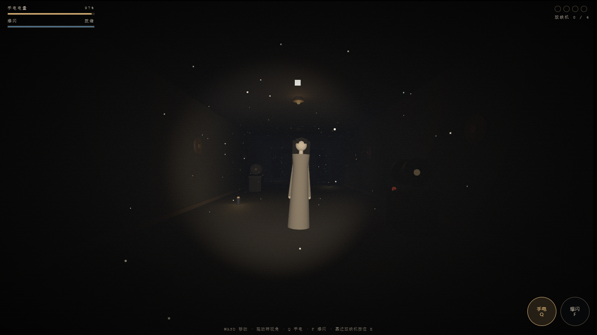
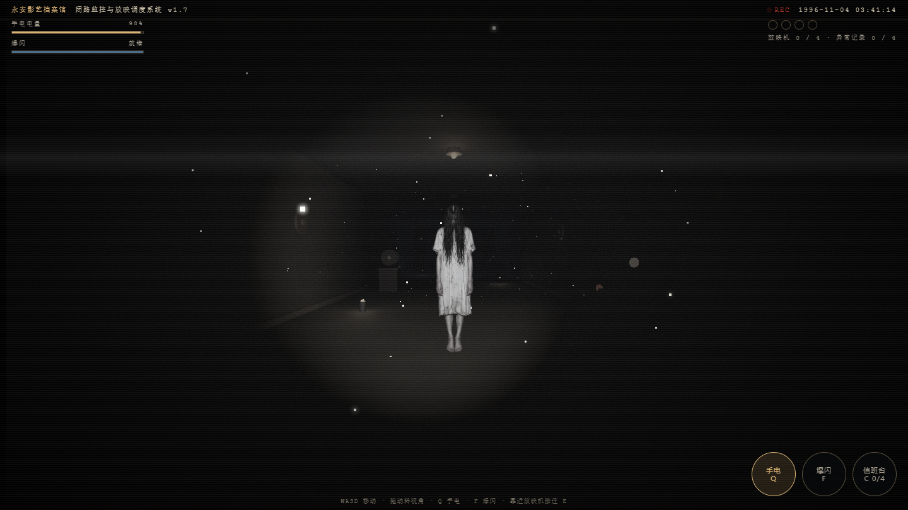
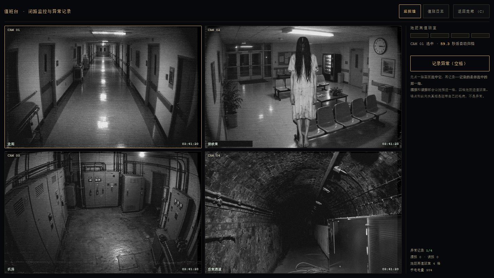

# 午夜放映员 · Midnight Projectionist

一个**模拟恐怖（analog horror）网站**形态的 3D 走廊潜行游戏。
单文件、离线、不联网。整个界面是一盘 1996 年的监控录像带：VHS 噪点、CRT 扫描线、走动的磁带时间码。

**双击 `index.html` 就能玩。**（`three.min.js` 必须和它在同一个文件夹里。）

---

## 两套玩法，同一份电量

这个游戏有两层，它们抢同一个资源。

**第一层：走廊。** 你要穿过走廊、启动四台放映机。她在走廊里，杀不死，只能被挡住。

**第二层：值班台。** 你要盯着四路监控画面，把「真异常」上报进值班日志。
窗口会越来越短、人形会越来越淡、磁带自己的毛病会混进来骗你。

**大门要开，两件事都得做完：四台放映机全亮 + 值班日志里四条异常记录。**

---

## 走廊

走廊停电了。四台放映机要一台台启动，尽头的大门才会开。

**走廊里还有她。她杀不死，只能被挡住。**

### 三条规则

1. **黑暗里她走得动，光里她动不了。**
2. **手电开着一秒掉 2.6% 电量，关掉一秒回 2.6%。** 你关掉的时候，她就在走。
3. **光要照得够近才按得住她——9 米以内。** 远了她只是被照亮，照样朝你走。

### 三种突破手段

| | 手段 | 代价 | 什么时候用 |
|---|---|---|---|
| ① | **按光**：光锥对着她，且她在 9 米内，她就定住 | 每秒 2.6% 电 | 常规手段。转身、照住、再走 |
| ② | **爆闪**（F）：推开约 6 米、定身 4 秒。**正面全额，绕到你背后也推得开（约六成）** | 25% 电 + 10 秒冷却 | 被围住时唯一的出路 |
| ③ | **放映机**：启动过的会一直亮着，半径 6.2 米内她动不了 | 启动时要站着不动 1.6 秒 | 存档点。也是走廊里唯一能喘气的地方 |

**核心抉择**：光能看见她、能钉住她，但光会耗尽。你永远在「看得见」和「还有电」之间选。

### 操作

| 键盘 | 触摸 |
|---|---|
| `W A S D` 移动 | 左下虚拟摇杆 |
| 拖动鼠标转视角 | 右侧拖动转视角 |
| `Q` 手电开关 | 「手电」按钮 |
| `F` 爆闪击退 | 「爆闪」按钮 |
| 靠近放映机**按住 `E`** 1.6 秒 | 同上（走过去按住） |
| `C` 开关值班台 | 右上角「值班台」按钮 |
| 值班台里 `1`–`4` 选画面 | 点画面选 |
| 值班台里 `空格` 上报 | 「记录异常」按钮 |
| 值班台里 `C` / `ESC` 退回走廊 | 「返回走廊」按钮 |

### 被抓之后

进度**保留**——已经亮着的放映机不会灭，你从入口重新出发。
但她会**更快**，而且走廊里的她会**变多**（每启动一台，就多一个）。

被抓时她已经贴到 1 米内了，所以你不会有"莫名其妙就死了"的感觉——
黑暗里你唯一的信息是**声音**：方位声像告诉你她在左还是右，心跳告诉你她有多近。

---

## 值班台（按 `C` 或点右上角）

走廊尽头有个值班台，四路监控画面在墙上。**她进不来**——但你坐在那儿的时候，
走廊里是静止的，而且值班台**自己耗电**。它不是避风港，是一个要付利息的暂停键。

### 你要做的事

**先点一路画面选中它，再按空格记录。记录的是你选中的那一路。**

画面里会出现两种东西，**只有一种是真异常**：

| | 现象 | 你该做什么 |
|---|---|---|
| **真异常** | 走廊尽头**出现人形** / 某一路**断电黑屏** | 选中**出问题的那一路**，记录（记一条，还回电 12%） |
| **磁带毛病** | 噪点加重、画面纵向失真、画面抖动 | **不要报**（报了算误报） |

**误报一次、漏报一次，都推进一格。四格 = 她进值班室。直接结束，不是扣血。**

三种会推进一格的情况：

1. 选中了**没有异常**的那一路就按记录
2. 把**磁带干扰**当成异常报上去
3. 异常出现了，**你没在窗口内记录**（或者直接关掉值班台走人）

> 为什么"选错路"要罚：不罚的话，你只要看见任何一路有异动就按空格，
> 四路画面就只是背景图，"判断"这个唯一的博弈就不存在了。
> 报对给 12% 电、报错只罚半格的话，"见异常就报"会变成最优解——所以两者的代价必须对等。

### 为什么这个循环难

- **窗口会越来越短**：第一条异常给你 6.6 秒，第四条只剩 3.9 秒。
- **人形会越来越淡**：第一条不透明度 0.96，第四条只剩 0.44——贴着噪点看才看得见。
- **开局不会给你陷阱**。前几条只有真异常，先教会你"什么算异常"，之后才把磁带干扰混进来。
- **磁带的毛病和异常长得很像**。这是整套玩法的核心：你要判断的是
  「**是这台机器坏了，还是这栋楼里有东西**」。

### 隐藏内容

值班日志里第 7 页是隐藏档案，能调阅出一段真实影像。自己找。

---

## 设置

- **低惊吓模式**：关掉红屏闪烁与刺耳音效，适合当众演示。
- **音效**：默认开。第一次点「关灯，进去」之前不会发出任何声音。
- **视角灵敏度**：0.4 ~ 2.2。

设置和进度都存在本机浏览器里（`localStorage`），不联网、不上传。

---

## 这一版改了什么

上一版是**几何体拼的女鬼 + 一条纯走廊**，玩法只有"开灯、转身、走"。
这一版换了真实图像，并且加了第二层（值班台 / 异常识别）。

| 上一版：几何体女鬼 | 这一版：真实照片 + VHS 滤镜 |
|:---:|:---:|
|  |  |
| **上一版：只有走廊一层** | **这一版：四路监控 + 异常记录** |
|  |  |

改这一版的原因很直接：上一版**赢得太轻松**。走廊那层只有一个正确解（转身、照住、走），
学会了之后就只是重复执行，既没有信息博弈也没有判断。
第二层加的不是"更多敌人"，而是**一个只有玩家会犯错的环节**。
完整推导写在 [`设计说明.md`](设计说明.md)。

---

## 技术说明

- 单个 HTML 文件 + 本地 `three.min.js`（Three.js r160），无构建、无 CDN。
- **9 张恐怖素材全部 base64 内联在 HTML 里**（`<script id="artData" type="application/json">`）。
  这不是为了好看——`file://` 下浏览器会拦掉 `fetch` / `XHR`，只有内联的 `data:` URI 能显示。
  代价是文件从 358 KB 涨到 1.13 MB，换来"双击就能玩、不联网、不 404"。
  原始图先压到 880×587 再有损编码（WebP 带 alpha、其余 JPEG q68~80），9 张共 567 KB。
- **女鬼是一张 Sprite 贴图**（billboard，永远正面朝你），不是几何体拼的。
  锚点在脚底（`center.set(0.5, 0)`），身高 2.3 米、按原图比例缩放，不会被拉变形。
  材质自发光，亮度在 `updateHunt` 里按距离手动压暗——远处退成灰影，近处才亮起来。
- **所有音效都是 WebAudio 现场合成的**，不含任何音频文件：
  - 存在感用两个相差 0.8Hz 的正弦叠加产生拍频（听久了会不舒服），左右声道跟着她的方位走。
  - 脚步、手电开关、放映机转动、爆闪、被抓，全部由振荡器 + 滤波器 + 噪声实时生成。
- 灰尘用加法混合 + 逐点着色，只在手电光锥里亮起来——黑暗里它完全不存在。
- 光源：手电是 `SpotLight`，钉住判定用的是独立的锥角与距离（比视觉光锥略宽，手感更宽容）。
- **VHS/CRT 层走一套统一的 `setInterval` 时钟**（磁带时间码、噪点、扫描线、画面抖动全靠它）。
  故意不用 `requestAnimationFrame`——测试的"渲染循环泄漏"判据看的就是 `__raf` 计数，
  监控层如果挂 rAF 上会把那条判据污染成假阳性。
- **值班台打开时整个走廊暂停**（`running = false`），`visibilitychange` 里也加了 `!cctv.open` 守卫，
  免得切回页签时把暂停状态误恢复掉。

## 想自己调数值

所有手感参数集中在文件开头的 `CFG` 里：

```js
const CFG = {
  eye:1.62, walk:3.05, look:0.0038,      // 身高 / 步速 / 视角灵敏度
  spotRange:20,                          // 手电照亮的视觉距离
  spotPower:16, spotDecay:0.90,          // 手电照度与衰减
  freezeR:9,                             // 光真正能钉住她的距离（关键平衡）
  lightCos:0.86,                         // 光锥判定（越小越宽容）
  drain:2.6, regen:2.6, torchMin:10,     // 耗电 / 回电 / 最低开灯电量
  safeR:6.2, catchR:0.98,                // 放映机安全圈 / 被抓距离
  flashCost:25, flashCd:10, flashR:6.5, flashPush:6.2, flashStun:4,
  holdNeed:1.6, holdRange:1.95,          // 按住 E 的时长 / 触发距离
  ghostSpeed:1.42, ghostGrow:0.16, maxGhosts:3
};
```

**最影响难度的是三个数**：`freezeR`（光能钉住她的距离）、`drain`（耗电速度）、`ghostSpeed`（她的速度）。
玩家步速 3.05 明显快过她，所以**你永远跑得掉**——压力来自那些必须站住不动的时刻，不是来自跑不过。

---

## 调试钩子

文件末尾挂了 `window.__MP`，把内部状态暴露出来，方便自动化验证。它不影响玩法：

```js
__MP.state      // 玩家位置、电量、手电、冷却、进度、生死
__MP.ghosts     // 每个她的位置、是否被定住、速度
__MP.stations   // 四台放映机的开关状态
__MP.door       // 大门开关与门叶位置
__MP.sim(秒)    // 不依赖渲染循环，直接推进世界（用于确定性测试）
__MP.pause() / __MP.resume()

// 值班台 / 异常识别
__MP.cctv            // 上报数、误报数、漏报数、格数、当前异常、难度
__MP.openCctv() / __MP.closeCctv()
__MP.cctvForce(type) // 立刻生成一个指定异常（'her' / 'black'）
__MP.cctvSpawn()     // 按当前难度随机生成（含磁带干扰陷阱）
__MP.cctvReport()    // 上报当前那一路
__MP.setReports(n) / __MP.setMisses(n) / __MP.setTrack(n)
__MP.revive()        // 从死亡状态复活（测试用）
__MP.art / __MP.osd  // 内联素材表 / 磁带时间码
__MP.ghostVisual(i)  // 第 i 个她的贴图比例与当前亮度
```

配套的自动化测试在 `tools/`：
- `tools/test_projectionist.cjs`（80 项断言）—— 核心游戏机制
- `tools/test_analog.cjs`（68 项断言）—— 素材内联 / VHS 外观 / 值班台 / 异常识别 / 手机端
- `tools/capture_analog.cjs` —— 抓图（`screenshots/` 里的图就是它抓的）

跑法见 `tools/README.md`。需要 Node 22+ 和 Edge/Chromium。

> 已知：K2 段 3 条「环境音」断言在**无头浏览器 + `--mute-audio`** 下必然失败
> （音频上下文是静音的，音量读数恒为 0）。v1 基线同样失败，属环境限制，不是回归。
